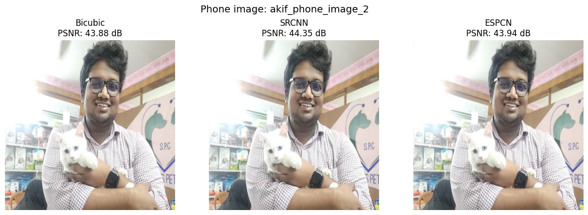
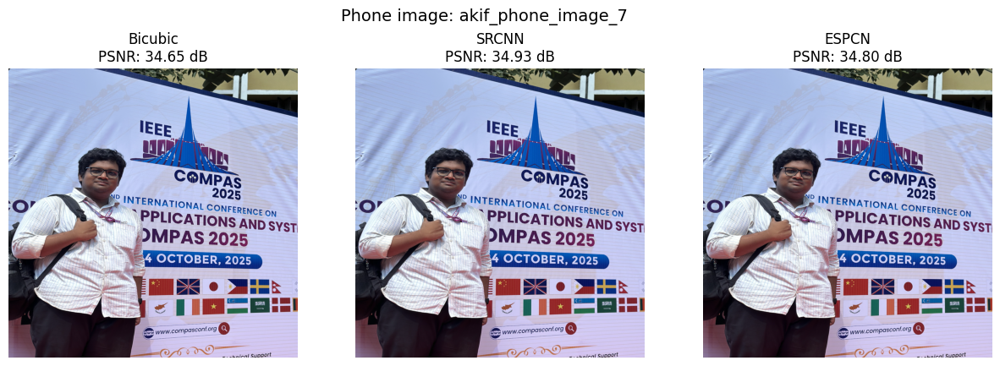
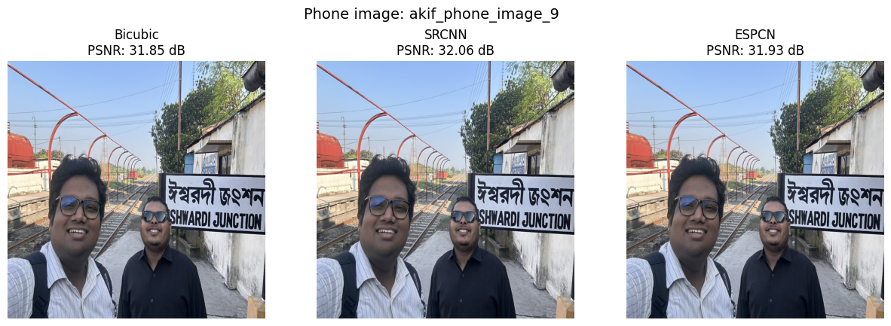
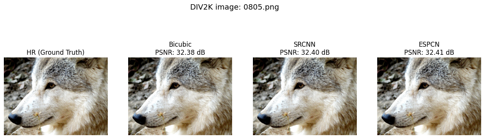

# 📸 Super-Resolution with SRCNN and ESPCN  
### *A Performance Comparison on DIV2K and Smartphone Images*

This repository contains the full implementation, experiments, and results for **super-resolution using SRCNN and ESPCN**, completed as part of a Computer Vision assignment.  
Both networks are trained from scratch for **2× upscaling** and evaluated on **DIV2K images** and **real smartphone photos**.

---

## 🚀 Overview

Single-Image Super-Resolution (SISR) reconstructs a high-resolution image from a low-resolution input.  
This project implements and compares:

### ✅ SRCNN  
- Classic 3-layer CNN  
- Operates on bicubic-upsampled images  
- Simple, effective baseline

### ✅ ESPCN  
- Efficient low-resolution processing  
- Pixel-shuffle (sub-pixel convolution) for upsampling  
- Produces sharp outputs with fewer FLOPs

---

## 📘 Code Availability

The complete training, testing, and visualization code is available in Google Colab:

🔵 **[Click here to view the full notebook](https://colab.research.google.com/drive/19qdUvVEDJwaps45EdtflohPfkEFKk_QK?usp=sharing)**

---

## 📂 Dataset

### **Training / Validation / Testing**
| Dataset | Train | Val | Test |
|--------|-------|-----|------|
| DIV2K HR Images | 800 | 100 | 100 |
| Smartphone Photos | – | – | 10 (Test only) |

DIV2K images were downsampled using bicubic interpolation (×2).  
Smartphone photos were used **only for evaluation** to test model generalization to real-world noise & compression artifacts.

---

## 🧠 Methodology

### 🔧 SRCNN Architecture  
- Feature extraction  
- Non-linear mapping  
- Reconstruction  
- Works on bicubic-upsampled LR input  

### 🔧 ESPCN Architecture  
- Processes image entirely in LR space  
- Uses pixel-shuffle (sub-pixel convolution)  
- Faster and often sharper  

### 🔧 Training Setup  
- Epochs: **300**  
- Optimizer: **Adam (lr = 1e-4)**  
- Loss: **MSE**  
- Batch size: **16**  
- Scale factor: **2×**

---

## 🖼️ Qualitative Examples

### DIV2K Samples  
| Red Panda | Church |
|----------|--------|
|  |  |

### Smartphone Image Examples  
#### 📱 Persian Cat (Phone Photo)


#### 📱 Conference Banner


#### 📱 Railway Station Selfie


### DIV2K Dog Sample


Each figure includes outputs from:
- Bicubic  
- SRCNN  
- ESPCN  
- Ground truth (HR)  
with PSNR values.

---

## 📊 Results

### **DIV2K Test Set (×2)**

| Method | PSNR (dB) | SSIM |
|--------|-----------|-------|
| **Bicubic** | **31.58** | 0.9150 |
| SRCNN | 31.51 | 0.9104 |
| ESPCN | 31.53 | **0.9152** |

➡️ ESPCN achieves the highest SSIM  
➡️ All methods perform similarly due to the small 2× upscale factor

---

### **Smartphone Photo Results**

| Method | PSNR (dB) |
|--------|-----------|
| Bicubic | 37.95 |
| **SRCNN** | **38.19** |
| ESPCN | 38.00 |

➡️ On real images, CNN models outperform bicubic  
➡️ **SRCNN slightly generalizes better**

---

## 📝 Discussion

Key findings:

- Improvements on DIV2K are **modest** due to shallow model depth and clean synthetic LR generation.
- Both CNN models consistently produce **sharper textures** than bicubic.
- Smartphone photos introduce noise + compression that CNN priors handle better.
- **SRCNN vs ESPCN:**  
  - ESPCN is slightly better on DIV2K  
  - SRCNN is more stable on real photos  
- Both models remain valuable for practical photo enhancement.

---
---

## 👤 Author

**Akif Islam**  
Master's Student, Department of CSE  
University of Rajshahi, Bangladesh  
📧 *iamakifislam@gmail.com*

---

### 📚 Citation

If you use any code snippet or take help from this repository, please cite the following paper:

```bibtex
@misc{ameen2025detectingaigeneratedimagesdiffusion,
      title={Detecting AI-Generated Images via Diffusion Snap-Back Reconstruction: A Forensic Approach}, 
      author={Mohd Ruhul Ameen and Akif Islam},
      year={2025},
      eprint={2511.00352},
      archivePrefix={arXiv},
      primaryClass={cs.CV},
      url={https://arxiv.org/abs/2511.00352}, 
}


